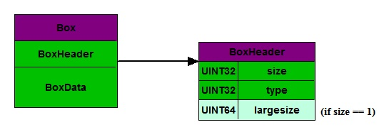

# MP4文件结构

- MP4文件格式很复杂，比flv复杂。
- MP4的文件头很大。
- MP4的文件头是一颗``Box``树：它有一个个的``Box``构成，大``Box``嵌套小的``Box``，一层层的嵌套，构成一颗树。
- 常用的``Box``种类不多：MP4官方定义了非常非常多的``Box``，如果要全部支持，会非常复杂。但是常用的，却没有那么多。

## Box结构

### 嵌套

一个``Box``由``BoxHeader``和``BoxData``组成。``BoxHeader``又由``size``和``type``组成。通常``size``只占4字节，对于大多数``Box``来说，是够用的；但是对于``mdat box``，用来存放视频或音频轨的，就不够用了，需要占8字节。为了支持这种拓展，约定当``size=1``的时候，表示特殊含义，表示它是一个``Large Size``，真实的长度从第三个字段``largeSize``读取。

### 常见Box

一般来说，解析MP4文件，最关心的是：
- 视频的宽高 (width/height)
- 时长 (duration)
- 码率 (bit rate)
- 编码格式 (H264/AAC)
- **帧列表 (Sample)** ：帧列表，每一帧的时间戳和偏移量。
- 关键帧列表 (Key Frame)
- ``Time Seeking``: 给定时间戳，找出文件中的位置

这些信息都存放在``stbl box``(``Sample Table Box``)下属的几个box中的，需要解析``stbl``下面所有的box，来还原媒体信息。

### TimeSeeking步骤

