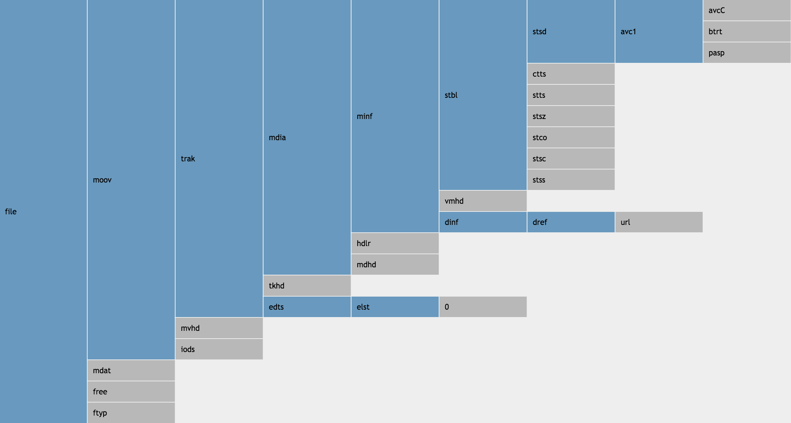
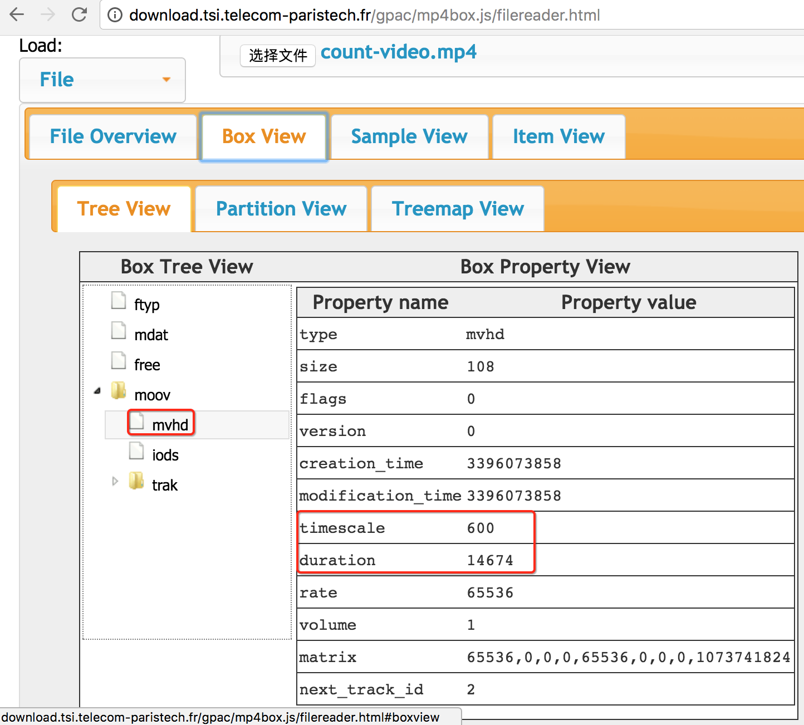
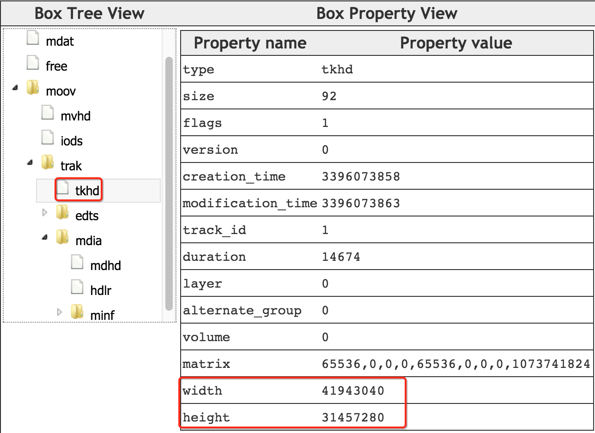
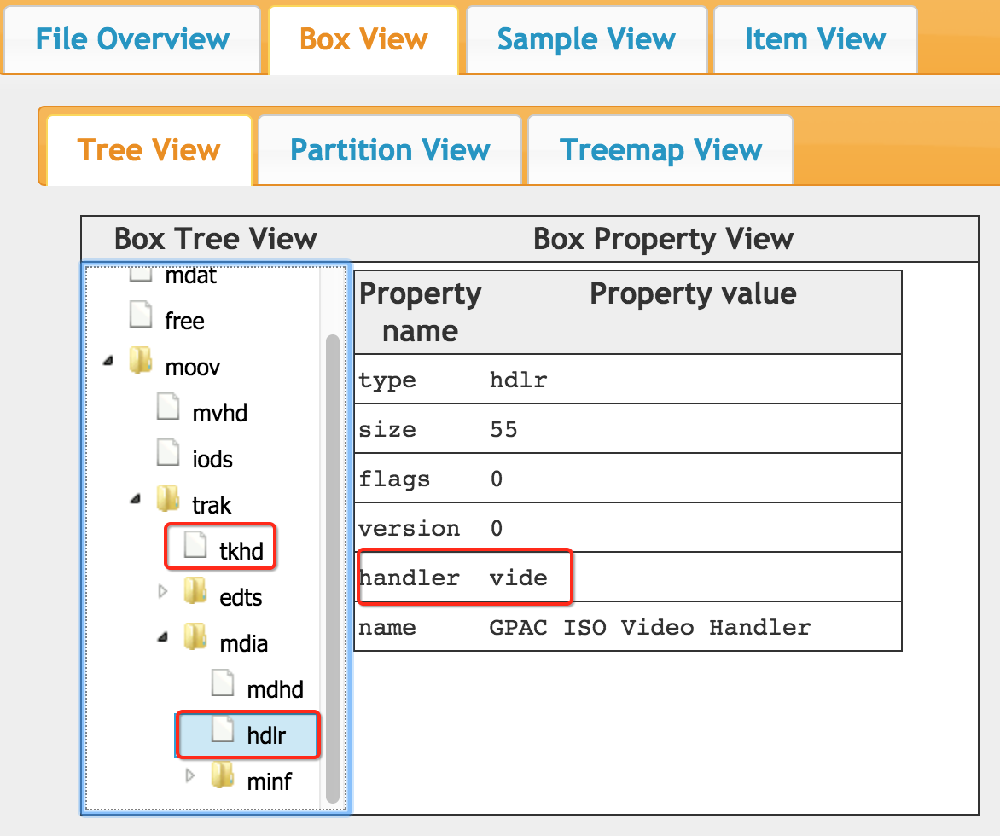
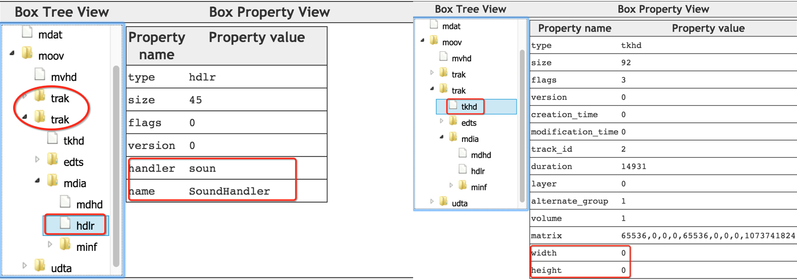
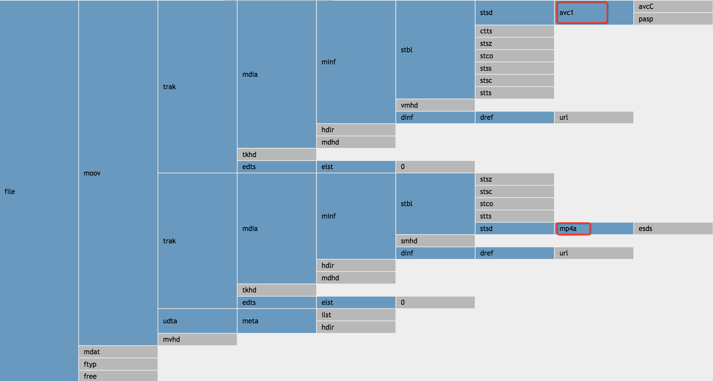
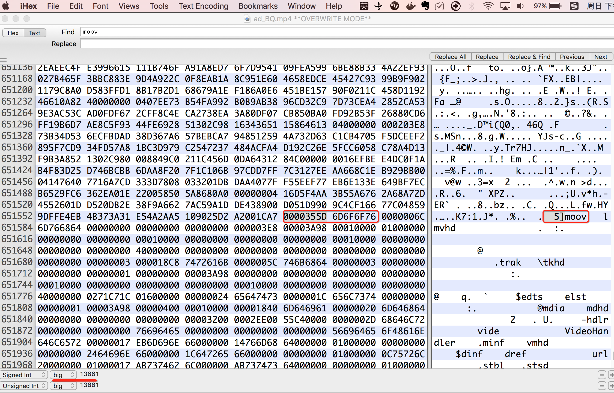

# MP4 Meta

## MP4 Box

>mp4是由一个个``box``组成的，大``box``中存放小``box``，**一级嵌套一级** 来存放媒体信息。可以嵌套其他``box``的``box``叫``container box``。

为了直观的明白这个概念，我们用开源项目 [mp4box.js](https://github.com/gpac/mp4box.js) 提供的MP4在线分析工具 [gpac/mp4box.js/filereader.html](http://download.tsi.telecom-paristech.fr/gpac/mp4box.js/filereader.html)，来分析[count-video.mp4](http://opbs7gfa4.bkt.clouddn.com/video/count-video.mp4)这个视频。



``MP4 Box``是一颗树，图中蓝色节点表示``container box``，灰色节点表示叶子节点。

## 提取时长

我们平时说的提取meta信息，多数信息都存储在``mvhd``这个``box``里。比如视频时长（指一个视频有多少秒），[count-video.mp4](http://opbs7gfa4.bkt.clouddn.com/video/count-video.mp4) 有24秒，播放器是怎么读取出来的呢？



如上图，它是用``moov``.``mvhd``.``duration`` / ``moov``.``mvhd``.``timescale`` = 14674 / 600 = 24.46 (秒)。

为什么MP4里面的时间单位没有用秒来度量？而是用``timescale``来度量？为了度量更加精确。视频是动图，每秒钟要播放24张图片（术语叫``帧率``），所以一个视频如果用秒来度量，极易会出现小数，正如这里的24.45666。类似的概念还有，初中学化学的时候，原子的质量也没用斤或千克来度量呀，而是用``碳十二原子质量的十二分之一作为单位1``，把这个``单位1``定义为摩尔质量，这样碳原子就是12摩尔，钾就是19摩尔了。

在Java中，用开源[mp4parser](https://github.com/sannies/mp4parser)可以解析MP4文件，它会预定义各种Box的解析器：

- ftyp=org.mp4parser.boxes.iso14496.part12.FileTypeBox
- moov=org.mp4parser.boxes.iso14496.part12.MovieBox
 - mvhd=org.mp4parser.boxes.iso14496.part12.MovieHeaderBox
 - trak=org.mp4parser.boxes.iso14496.part12.TrackBox
   - tkhd=org.mp4parser.boxes.iso14496.part12.TrackHeaderBox
- mdat=org.mp4parser.boxes.iso14496.part12.MediaDataBox

然后解析MP4文件，并从``mvhd``中读取``duration``和``timescale``信息，并计算以秒为单位的视频时长：

``` java
import org.mp4parser.IsoFile;

URL mp4Url = Thread.currentThread().getContextClassLoader().getResource("count-video.mp4");
IsoFile isoFile = new IsoFile(mp4Url.getFile());

double durationInSeconds = (double) isoFile.getMovieBox().getMovieHeaderBox().getDuration()
				/ isoFile.getMovieBox().getMovieHeaderBox().getTimescale();

LOG.info("duration in seconds: {}", durationInSeconds);
```

----

## 提取宽高

宽高指的是视频的宽高，所以首先需要找到视频轨（``trak``.``media``.``hdlr``），再找到视频轨的头部信息（``trak``.``tkhd``）。
依然以[count-video.mp4](http://opbs7gfa4.bkt.clouddn.com/video/count-video.mp4)视频为例，它是一个无声音的视频，只有1个视频轨：



上图找到``tkhd``，里面有width=41943040和height=31457280，分别除以65535，结果就是640*480。
但是我们如何就能确认它就是视频轨的呢？很奇怪``tkhd``里面没有任何信息能表示它是视频，还是音频或是其他。除了``track_id``似乎有点这个味道
事实上，的确单看``tkhd``（``trak``.``tkhd``）是看不出视频还是音频的，需要看轨道的``HandlerBox``，也就是 ``tkhd``的 **兄弟节点的孩子节点** ``trak``.``media``.``hdlr``，这种设计让读取时，特别绕。




在看一个有音频轨的视频 [ad_BQ.mp4](http://opbs7gfa4.bkt.clouddn.com/video/ad_BQ.mp4)：



可以看到，它有两个轨道，其中音频轨的宽度和高度都是0。但是区分音频轨，还是视频轨道，得看``trak``.``media``.``hdlr``信息，而不是看``trak``.``tkhd``。展开所有的``box``：



里面还有一个``udta``，表示``User Data``.
下面一段代码从视频流中读取视频的宽高：

``` java
public class GetWidthHeight {

    public static void main(String[] args) throws IOException {
        String mp4File = Thread.currentThread().getContextClassLoader().getResource("count-video.mp4").getFile();
        FileInputStream fis = new FileInputStream(new File(mp4File));

        GetWidthHeight ps = new GetWidthHeight();
        ps.find(fis);
    }

    private byte[] lastTkhd;

    public void find(InputStream fis) throws IOException {

        while (fis.available() > 0) {
            byte[] header = new byte[8];
            fis.read(header);

            long size = readUint32(header, 0); // 4B Size
            String type = new String(header, 4, 4, "ISO-8859-1"); // 4B Type
            if (isContainerBox(type)) {
                find(fis); // body is another Box
            } else {
                if (type.equals("tkhd")) {
                    lastTkhd = new byte[(int) (size - 8)]; // tkhd box's body length
                    fis.read(lastTkhd); // tkhd box's body content
                } else if (type.equals("hdlr")) {
                	byte[] hdlr = new byte[(int) (size - 8)]; // hdlr box's body length
                	fis.read(hdlr);
                	if (hdlr[8] == 0x76 && hdlr[9] == 0x69 && hdlr[10] == 0x64 && hdlr[11] == 0x65) {
                		System.out.println("Video Track Header identified");
                		System.out.println("width: " + readFixedPoint1616(lastTkhd, lastTkhd.length - 8));
                		System.out.println("height: " + readFixedPoint1616(lastTkhd, lastTkhd.length - 4));
                		System.exit(1);
                	}
                } else {
                    fis.skip(size - 8); // skip body for other leaf boxes
                }
           }
        }
    }

    private static boolean isContainerBox(String type) {
    	return containerBoxes.contains(type);
    }

    private static TreeSet<String> containerBoxes = new TreeSet<>(Arrays.asList(
            "moov",
            "trak",
            "mdia"
    ));

    private static long readUint32(byte[] b, int s) {
        long result = 0;
        result |= ((b[s + 0] << 24) & 0xFF000000);
        result |= ((b[s + 1] << 16) & 0xFF0000);
        result |= ((b[s + 2] << 8) & 0xFF00);
        result |= ((b[s + 3]) & 0xFF);
        return result;
    }

    private static double readFixedPoint1616(byte[] b, int s) {
        return ((double) readUint32(b, s)) / 65536;
    }
}
```

----
----

## 找到``moov``

前面看到，MP4的结构由一个个``box``组成，每个``box``都由``box header``和``box body``组成。其中``box header``又分成4字节的Size与4字节的Type（如果Size=1，表示这个Box是一个Large Box，需要8字节表示Size）。


它的Type是4位ASCII码，有点像纳斯达克的股票代号。这样的好处是，我们随便用一个十六进制编辑器(比如``iHex``)，就能打开MP4文件，并且快速找到``moov``的位置。



在编辑器内搜索``moov``，它占4字节，找到对应的位置，然后再看它前4个字节，它是Size。注意下方状态栏，把这4字节，按照网络序，编码成Int数，结果是13661字节。这样也就是``moov``的body content的长度是 13661 - 8 = 13653。

----


## 电影声音采样频率

从tkhd – track header atom中找出audio track的time scale即是声音的采样频率


## 计算视频帧率

首先计算出整部电影的duration，和帧的数目然后

帧率 = 整部电影的duration / 帧的数目

## 比特率

整部电影的尺寸除以长度，即是比特率，此电影的比特率为846623/70 = 12094 bps


## 查找``sample``

当播放一部电影或者一个track的时候，对应的media handler必须能够正确的解析数据流，对一定的时间获取对应的媒体数据。如果是视频媒体， media handler可能会解析多个atom，才能找到给定时间的sample的大小和位置。具体步骤如下：

1. 确定时间，相对于媒体时间坐标系统
2. 检查time-to-sample atom来确定给定时间的sample序号。
3. 检查sample-to-chunk atom来发现对应该sample的chunk。
4. 从chunk offset atom中提取该trunk的偏移量。
5. 利用sample size atom找到sample在trunk内的偏移量和sample的大小。


例如，如果要找第1秒的视频数据，过程如下：

1. 第1秒的视频数据相对于此电影的时间为600
2. 检查time-to-sample atom，得出每个sample的duration是40，从而得出需要寻找第600/40 = 15 + 1 = 16个sample
3. 检查sample-to-chunk atom，得到该sample属于第5个chunk的第一个sample，该chunk共有4个sample
4. 检查chunk offset atom找到第5个trunk的偏移量是20472
5. 由于第16个sample是第5个trunk的第一个sample，所以不用检查sample size atom，trunk的偏移量即是该sample的偏移量20472。如果是这个trunk的第二个sample，则从sample size atom中找到该trunk的前一个sample的大小，然后加上偏移量即可得到实际位置。
6. 得到位置后，即可取出相应数据进行解码，播放


## 查找关键帧

查找过程与查找sample的过程非常类似，只是需要利用sync sample atom来确定key frame的sample序号

确定给定时间的sample序号
检查sync sample atom来发现这个sample序号之后的key frame
检查sample-to-chunk atom来发现对应该sample的chunk
从chunk offset atom中提取该trunk的偏移量
利用sample size atom找到sample在trunk内的偏移量和sample的大小


## Random access

Seeking主要是利用sample table box里面包含的子box来实现的，还需要考虑edit list的影响。

可以按照以下步骤seek某一个track到某个时间T，注意这个T是以movie header box里定义的time scale为单位的：

如果track有一个edit list，遍历所有的edit，找到T落在哪个edit里面。将Edit的开始时间变换为以movie time scale为单位，得到EST，T减去EST，得到T'，就是在这个edit里面的duration，注意此时T'是以movie的time scale为单位的。然后将T'转化成track媒体的time scale，得到T''。T''与Edit的开始时间相加得到以track媒体的time scale为单位的时间点T'''。
这个track的time-to-sample表说明了该track中每个sample对应的时间信息，利用这个表就可以得到T'''对应的sample NT。
sample NT可能不是一个random access point，这样就需要其他表的帮助来找到最近的random access point。一个表是sync sample表，定义哪些sample是random access point。使用这个表就可以找到指定时间点最近的sync sample。如果没有这个表，就说明所有的sample都是synchronization points，问题就变得更容易了。另一个shadow sync box可以帮助内容作者定义一些特殊的samples，它们不用在网络中传输，但是可以作为额外的random access point。这就改进了random access，同时不会影响正常的传输比特率。这个表指出了非random access point和random access point之间的关系。如果要寻找指定sample之前最近的shadow sync sample，就需要查询这个表。总之，利用sync sample和shadow sync表，就可以seek到NT之前的最近的access point sample Nap。
找到用于access point的sample Nap之后，利用sample-to-chunk表来确定sample位于哪个chunk内。
找到chunk后，使用chunk offset找到这个chunk的开始位置。
使用sample-to-chunk表和sample size表中的数据，找到Nap在此chunk内的位置，再加上此chunk的开始位置，就找到了Nap在文件中的位置。
