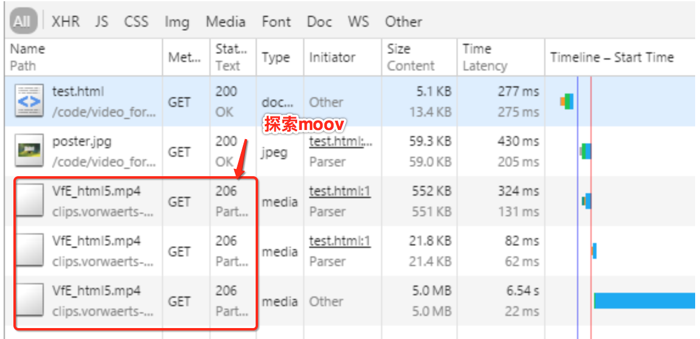

# 边下边播

在老系统中有部分MP4视频在播放时需要完全加载完才能播放，使得用户体验很差（现在都是边下载边播放模式），造成这种情况的原因是用来描述MP4文件的``moov``元数据被放在MP4文件的 **末尾**，而大部分网络播放器都会去读取这个元数据用以确认视频长度，分辨率等等参数，因此只需要将MP4文件的``moov`` 元数据移到最前面就行。

当然有的播放器做得比较好，它能够同时兼容``moov``放在前面，还是放在后面。对于放在后面的，播放器会用``Range Request``探索几次：先下载头502字节，再下载尾巴多少字节，直到发现``moov box``。尽管这种探索最后也能边下边播，但是探索的过程无疑是要浪费时间的。所以，网络流媒体，MP4就应该把``moov box``放在最前面。

另一方面，即便播放器做了完美的兼容，支持探索``moov``。但是如果HTTP服务器不支持``Range Request``也是白搭，也会导致必须全部现在完才能播放。

**温馨提醒**
>用的最官方的``ffmpeg``转码工具，把其他视频转码成MP4，它默认是把``moov``放在 **后面**，也就是 **没有** 为网络流播放优化的。
> 当然``ffmpeg``只需一个参数，就能把``moov``放到前面，这个参数是``-movflags faststart``。完整指令：
> ``ffmpeg -i input.mp4 -movflags faststart -acodec copy -vcodec copy output.mp4``

----

## 寻找``moov``

### 放在最前面

>When you play a video, the program looks through the MP4 file, locates the ``moov`` atom , and then uses that to find the start of the audio and video data and begin playing. **Unfortunately**, atoms can appear in any order, so the program doesn’t know where the moov atom will be ahead of time.

当我们要播放一个视频的时候，播放器要读MP4文件，首先必须寻找``moov``类型的``box``。这种类型的``box``有且仅有一个，但是它对顺序没有要求，它既可以出现在前面，也可以出现在后面，也可以出现在中间。

>Searching to find the moov works fine if you already have the entire video file. However another option is needed when you don’t have the entire video yet, such as when you are ``streaming`` HTML5 video. That’s the whole point of streaming a video! You can start watching it **without having to download the entire video first**.

如果在本地播放，我们读取整个文件，可以快速找到``moov box``。但是如果是网络视频，我们想边下边播，而不用等整个视频下载完，就可以播放。我们就需要把``moov``刻意放到前面。

### 放在最后面

>When streaming, your browser requests the video and starts receiving the beginning of the file. It looks to see if the moov atom is near the start. If the moov atom is not near the start, it must either download the entire file to try and find the moov, or the browser can **download small different pieces of the video file, starting with data from the very end**, in an attempt to find the moov atom.

如果前面没找到``moov``，浏览器可以尝试从后面探索``moov``。

>All this seeking around trying to find the moov wastes time and bandwidth. Unfortunately, the video cannot play until the moov is located. We can see in the screen shot below a waterfall chart of a browser trying to stream an unoptimized MP4 file using HTML5 video:

上述图片可以看到，如果``moov``放在后面，播放器总共要发送3个请求，才能播放视频。

You can see the browser makes **3 requests** before it can start playing the video.
- In the first request, the browser downloads the first 552 KB of the video using an HTTP range request. We can tell this by the 206 Partial Content HTTP response code, and by digging in and looking at the request headers. However the moov atom is not there so the browser cannot start to play the video.

- Next, the browser requests the final 21 KB of the video file using another range request. This does contain the moov atom, telling the browser where the video and audio streams start.

- Finally, the browser makes a third and final request to get the audio/video data and can start to play the video. This has wasted over half a megabyte of bandwidth and delayed the start of the video by 210 ms! Simply because the browser couldn’t find the moov atom.

It gets even worse if you haven’t configured your server to support HTTP range requests; the browser can’t skip around to find the moov and must download the entire file. This is yet another reason why your should optimize your site with partial download support.

如果HTTP服务器，不支持``Range Request``，那播放器就没法探索``moov``的位置了。

## 参考资料

- [optimizing-mp4-video-for-fast-streaming](https://rigor.com/blog/2016/01/optimizing-mp4-video-for-fast-streaming)
