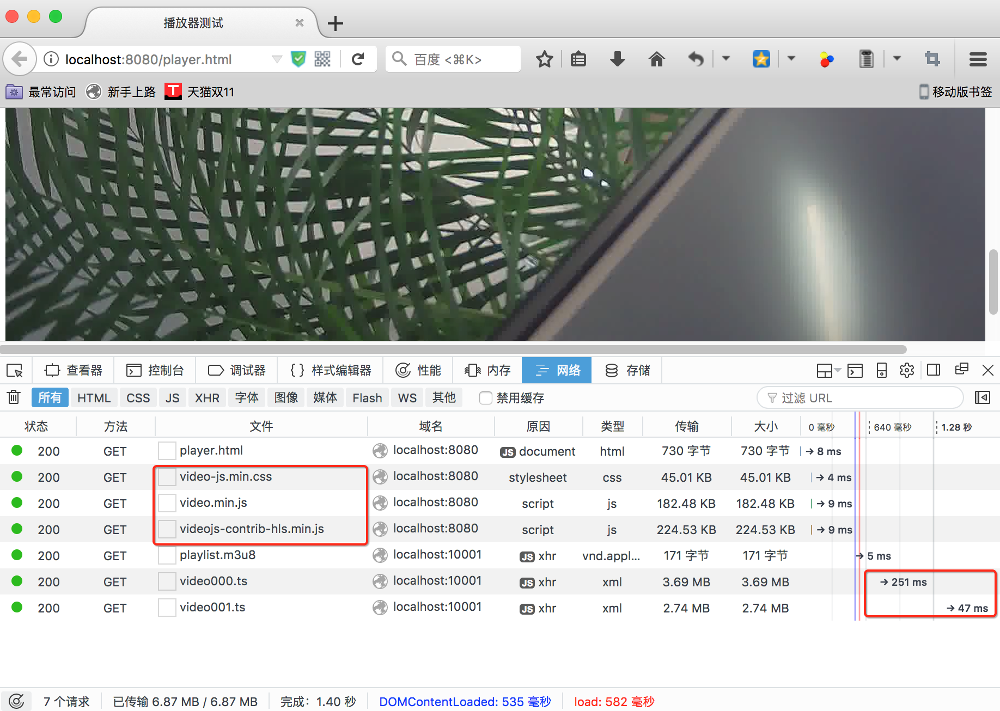
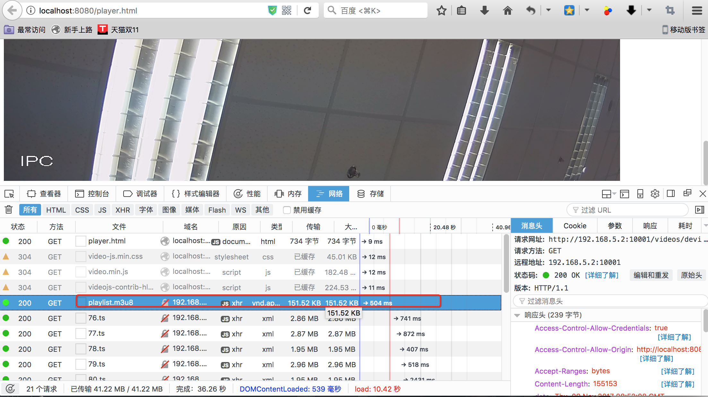

# 播放器测试

## 播放器引用

### player version

- [video.js](https://github.com/videojs/video.js): 6.4.0
- [videojs-contrib-hls](https://github.com/videojs/videojs-contrib-hls): v5.12.2

### 资源引用

``` html
<link href="js/video-js-6.4.0/video-js.min.css" rel="stylesheet">
<script src="js/video-js-6.4.0/video.min.js"></script>
<script src="js/videojs-contrib-hls/v5.12.2/videojs-contrib-hls.min.js"></script>
```

>只会用到3个文件：
>- video.min.js: 播放器基础JS
>- video-js.min.css: 播放器样式
>- videojs-contrib-hls.min.js: HLS解码器

## 播放测试

### 样片地址

```
http://localhost:10001/videos/F5-01/20171024/playlist.m3u8
```

### 16:9的分辨率

``` text
320*180, 480*270, 640*360,720*405,854*480,960*540,1080*600,1280*720,1920*1080
```

### 播放画面



## 超大``playlist``


