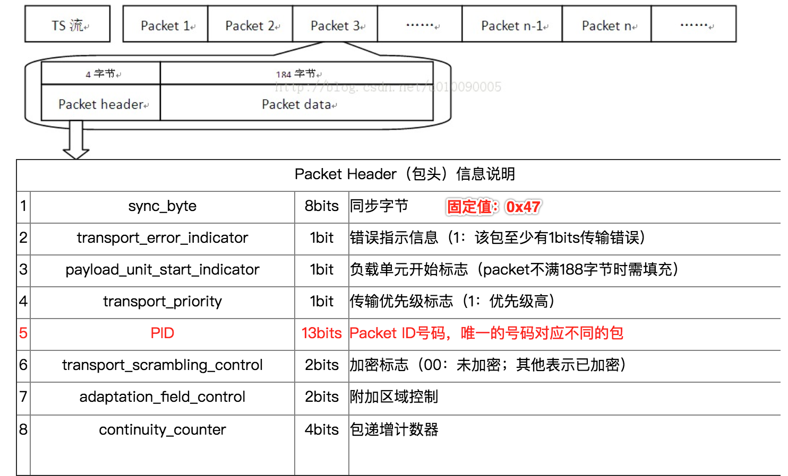
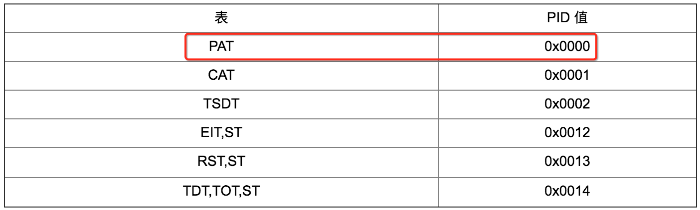
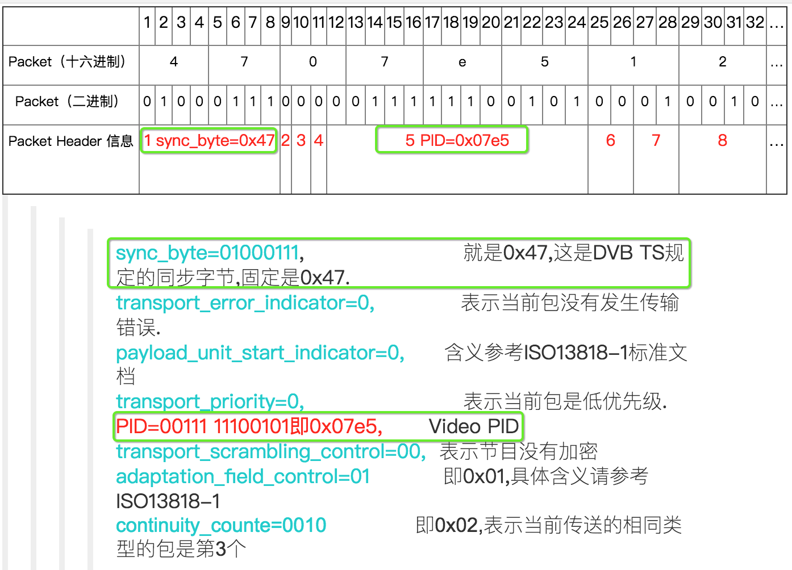

# TS流

## TS流结构描述

- **ts简介**:  ``ts``流（英文是``Transport Stream``）最早应用于``数字电视``领域（比如歌华的机顶盒传输的就是TS流），其格式非常复杂包含的配置信息表多大十几个，视频格式主要是``mpeg2``。苹果公司发明的``http live stream``（以下简称``hls``）流媒体是基于``ts``文件的，不过他 **大大简化了传统的ts流**，只需要2个最基本的配置表``PAT``和``PMT``，再加上音视频内容就可以了，``hls``流媒体视频编码的主要格式为``h264/mpeg4``，音频为``aac/mp3``。

- **ts格式**: ts文件分为三层：ts层（Transport Stream）、pes层（Packet Elemental Stream）、es层（Elementary Stream）。
es层就是音视频数据，pes层是在音视频数据上加了时间戳等对数据帧的说明信息，ts层是在pes层上加入了数据流识别和传输的必要信息。

- **ts层**: ts包大小 **固定为188字节**，ts层分为三个部分：ts header、adaptation field、payload。ts header固定4个字节；adaptation field可能存在也可能不存在，主要作用是给不足188字节的数据做填充；payload是pes数据。     

- **ts文件**: ts文件由连续的``ts包``构成，每个``ts包``固定为188个字节，因此ts文件的大小一定是188的整数倍。每个``ts包``在头部都有一个ID字段，用来表示这个包是干什么的，这个ID叫做``PID``（``Packet Identity``）。

### TS文件与TS包

### 头部的PID字段

 ``PID``是TS流中唯一识别标志，**Packet Data是什么内容就是由PID决定的**。

 如果一个TS流中的一个Packet的Packet Header中的PID是``0x0000``，那么这个Packet的Packet Data就是DVB的``PAT表``而非其他类型数据（如Video、Audio或其他业务信息）。

下表给出了一些表的PID值，这些值是固定的，不允许用于更改。

### TS Pack 头部样例

下面以 **一个TS流** 的 **其中一个Packet** 中的``Packet Header``（固定为4字节）为例进行说明：

### 回顾总结

 TS流是由一个个Packet（包）构成的，每个包都是由Packet Header（包头）和Packet Data（包数据）组成的。其中Packet Header指示了该Packet是什么属性的，并给出了该Packet Data的数据的唯一网络标识符``PID``。

----

## 特殊的Packet: ``PAT``和``PMT``

说完了TS流的基本概念，就该开始对TS流进行更深入的研究了。首先需要想一想：TS流的本质是什么？它的确是一段码流，并且是一段由数据包（Packet）组成的码流。那么这些数据包究竟是怎样的呢？它和我们收看的电视节目之间又有什么区别？这些都是这部分需要了解的内容。

在上一节中，我们可以看到PID这个被标红的字段频繁地出现。PID是当前TS流的Packet区别于其他Packet类型的唯一识别符，**通过读取每个包的Packet Header，我们可以知道这个Packet的数据属于何种类型**。上一节列出了几项固定的PID值，它们用于识别存储了特殊信息的Packet。下面要谈的PAT表的PID值就是固定的0x0000。

## 参考资料

- [TS流结构](http://www.cnblogs.com/shakin/p/3714848.html)：五星推荐
- [TS流可视化解析工具](https://www.elecard.com/products/video-analysis/stream-analyzer): Elecard Stream Analyzer
